# 🎓 EduDesk — College Helpdesk & Query Management System

> A modern Android application that bridges the gap between students and faculty — enabling seamless ticket-based query management and real-time chat.

---

| Login | Home | Registration |
|-------|------|--------------|
| 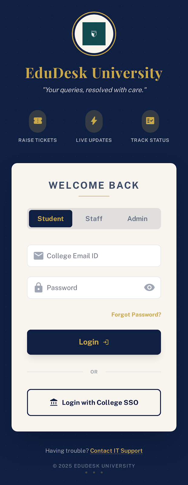 | 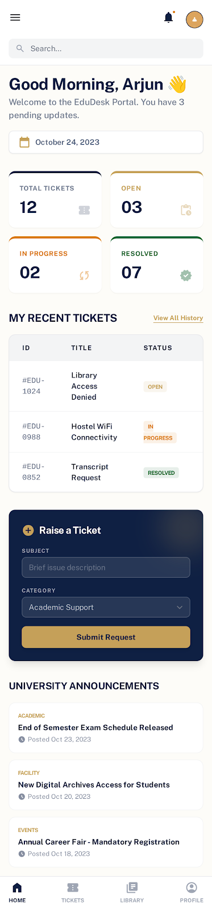 | 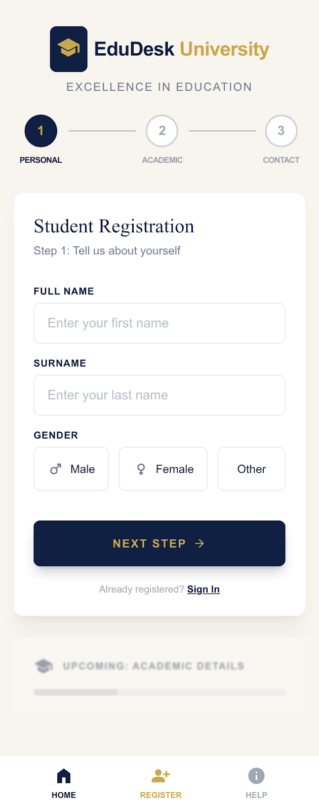 |

| Raise Ticket | File Upload | Ticket Review |
|-------------|-------------|---------------|
| 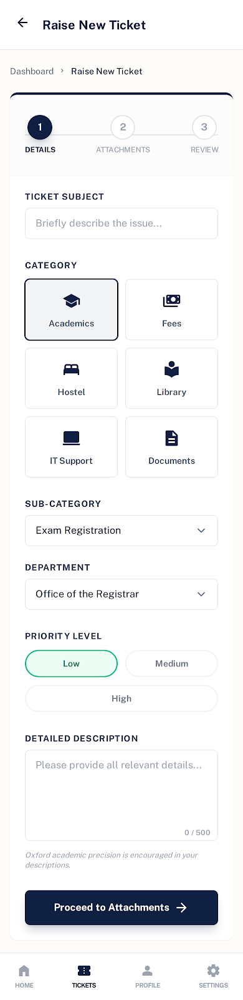 | 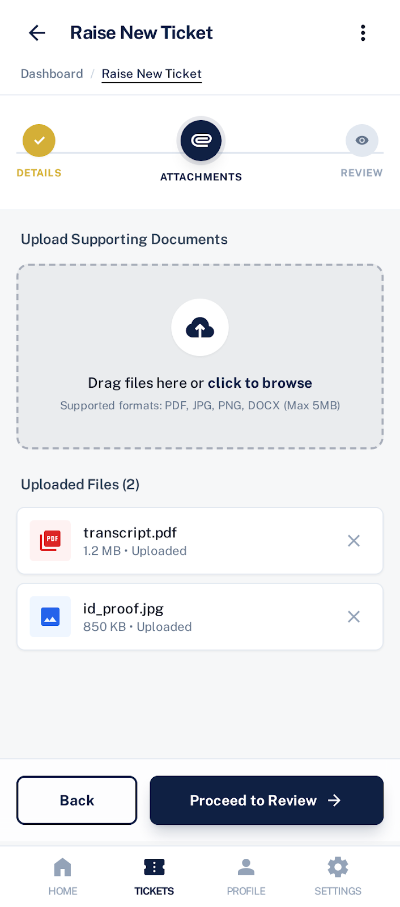 | 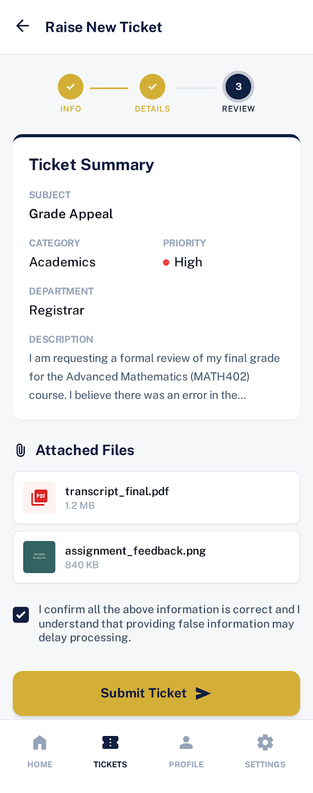 |

| My Tickets | Chat List | Chat Screen |
|-----------|-----------|-------------|
| 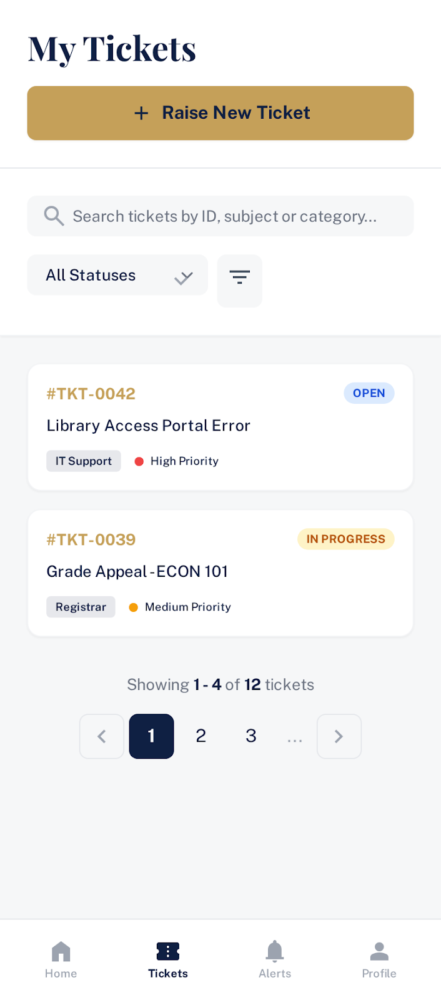 | 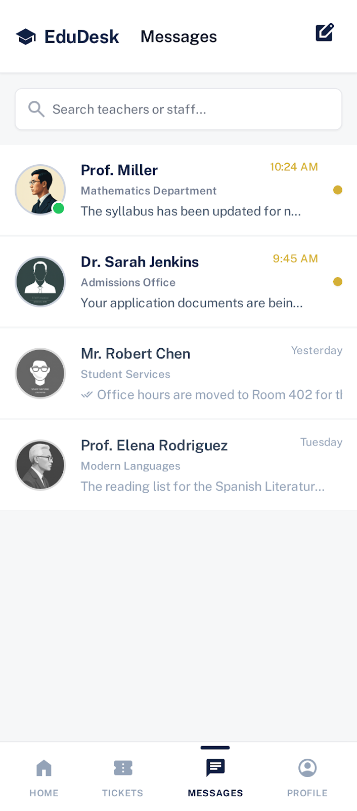 | 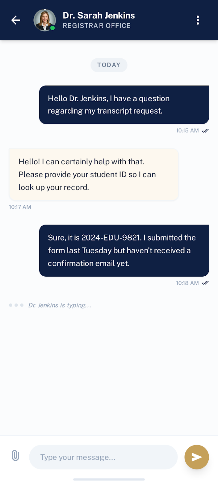 |

### 👨‍🏫 Faculty Side
| Dashboard | Analytics | Profile |
|-----------|-----------|---------|
| 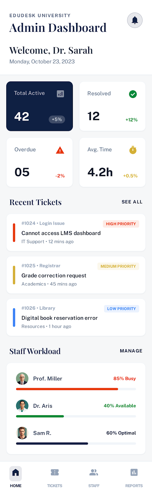 | 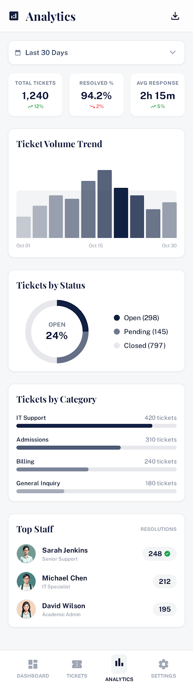 | 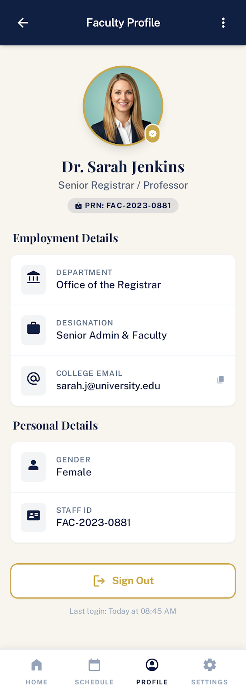 |

## ✨ Features

### 👨‍🎓 Student Side
- 📝 **Student Registration** — PRN-based registration with duplicate check
- 🔐 **OTP Login** — Secure email OTP authentication (no password needed)
- 🎫 **Raise Tickets** — Submit queries with category, description & file attachments
- 📂 **Multiple File Upload** — Upload up to 5 files (PDF, Word, Excel, Images) via Supabase
- 💬 **Real-time Chat** — Chat directly with faculty, messages stored permanently
- 🔍 **Faculty Search** — Search faculty by name or UID instantly

### 👨‍🏫 Faculty Side
- 🔐 **Secure Login** — Email & password authentication
- 📋 **View Assigned Tickets** — See all student queries assigned to them
- 💬 **Real-time Chat** — Reply to student queries instantly
- 👤 **Profile Management** — View profile & sign out securely

### 🔧 General
- 📱 **Session Management** — 60-day auto login (separate for student & faculty)
- 🌙 **Time-based Greeting** — Good Morning / Afternoon / Evening / Night
- ⬅️ **Smart Back Navigation** — ViewFlipper + Fragment back press handled properly
- 🎨 **Navy & Gold Theme** — Professional college branding (#1A2340 + #C9A84C)

---

## 🛠️ Tech Stack

| Category | Technology |
|----------|------------|
| **Language** | Java |
| **Platform** | Android (Min SDK 24) |
| **Authentication** | Firebase Authentication |
| **Database** | Firebase Firestore |
| **File Storage** | Supabase Storage |
| **Email OTP** | EmailJS |
| **Session** | SharedPreferences |
| **UI Components** | ViewPager2, ViewFlipper, RecyclerView |
| **IDE** | Android Studio |

---

## 🗄️ Database Architecture

```
Firestore/
├── users/
│   └── {uid}/
│       ├── firstName, surname, fullName
│       ├── prn, email, phone
│       ├── course, year, college
│       └── role: "student"
│
├── faculty_user/
│   └── {uid}/
│       ├── firstName, surname, fullName
│       ├── email, phone
│       ├── department, subject, college
│       └── role: "faculty"
│
├── tickets/
│   └── {ticketId}/
│       ├── studentUid, studentName, studentPrn
│       ├── facultyUid, facultyName
│       ├── subject, category, description
│       ├── status: "Open" → "In Progress" → "Resolved"
│       └── fileUrls[], fileNames[]
│
└── chats/
    └── {studentUid_facultyUid}/
        ├── studentUid, facultyUid
        ├── studentName, facultyName
        ├── lastMessage, lastMessageTime
        └── messages/
            └── {messageId}/
                ├── senderUid, text
                ├── fileUrl, fileName
                └── timestamp, seen
```

---

## 📂 Project Structure

```
app/
├── activities/
│   ├── LoginPage.java
│   ├── MainActivity.java
│   ├── Student_Registration.java
│   ├── FacultyRegistration.java
│   ├── Faculty_main_activity.java
│   ├── SearchChat.java
│   └── Chat_Screen.java
│
├── fragments/
│   ├── Home.java
│   ├── Ticket.java
│   ├── Chat.java
│   ├── Profile.java
│   └── Profile_Faculty_fragment.java
│
└── utils/
    ├── SessionManager.java
    ├── OtpManager.java
    ├── InsertDataOfFaculty.java
    ├── FacultyAdapter.java
    └── FileDisplayContainer.java
```

---

## 🔐 Authentication Flow

```
App Open
    ↓
Session Check (SharedPreferences)
    ↓
Valid Session → Fetch Firestore Data → Dashboard
No Session   → LoginPage
    ↓
Student: PRN → OTP Email → Verify → MainActivity
Faculty: Email + Password → Faculty_main_activity
```

---

## 📁 File Upload Flow

```
Student selects files (max 5, 10MB each)
    ↓
Files stored as URI locally (no upload yet)
    ↓
Student submits ticket
    ↓
Files uploaded to Supabase Storage
    ↓
Public URLs received
    ↓
URLs saved to Firestore with ticket data
    ↓
Faculty opens ticket → Views/Downloads files
```

---

## ⚙️ Setup & Installation

### Prerequisites
- Android Studio (latest)
- Firebase project (Firestore + Authentication enabled)
- Supabase account (Storage bucket: `ticket-files`)
- EmailJS account

### Steps

1. **Clone the repo**
   ```bash
   git clone https://github.com/yourusername/EduDesk.git
   ```

2. **Add Firebase config**
   - Download `google-services.json` from Firebase Console
   - Place it in `/app` directory

3. **Add Supabase credentials** in `SupabaseManager.java`
   ```java
   private static final String SUPABASE_URL = "your_project_url";
   private static final String SUPABASE_KEY = "your_publishable_key";
   ```

4. **Add EmailJS credentials** in `OtpManager.java`
   ```java
   private static final String SERVICE_ID  = "your_service_id";
   private static final String TEMPLATE_ID = "your_template_id";
   private static final String PUBLIC_KEY  = "your_public_key";
   ```

5. **Build & Run**
   ```
   Build → Clean Project → Run ▶️
   ```

---

## 👨‍💻 Developer

**Bharat Choudhary**
TY BCA — Semester VI

---

## 📄 License

This project is developed as part of academic coursework.

---

> ⭐ If you found this helpful, consider starring the repo!
